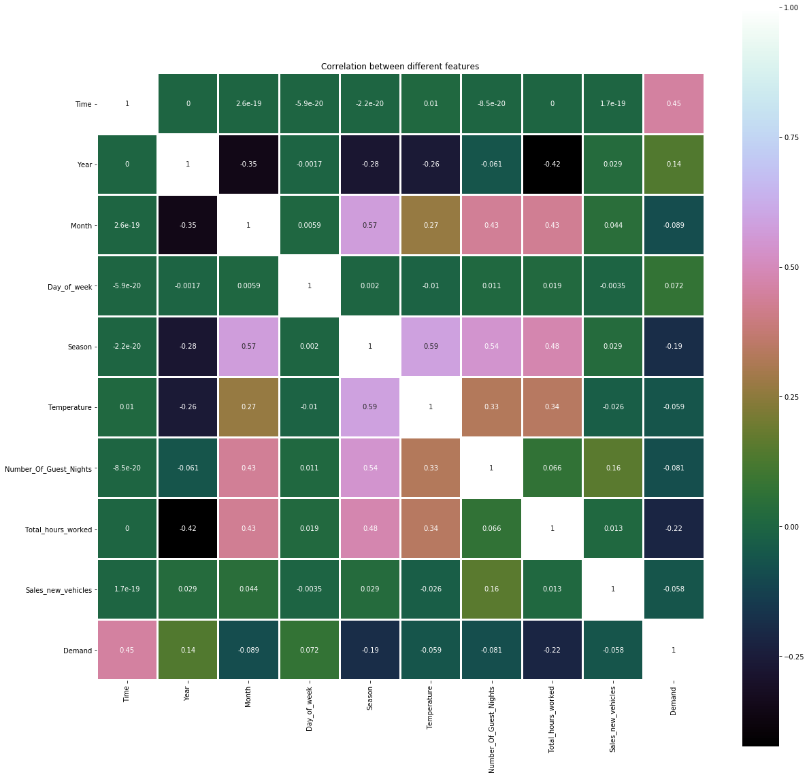
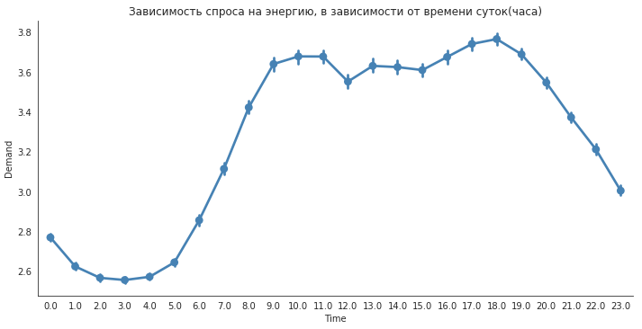
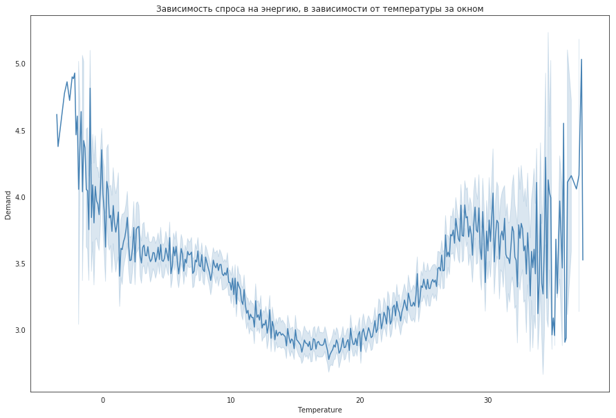
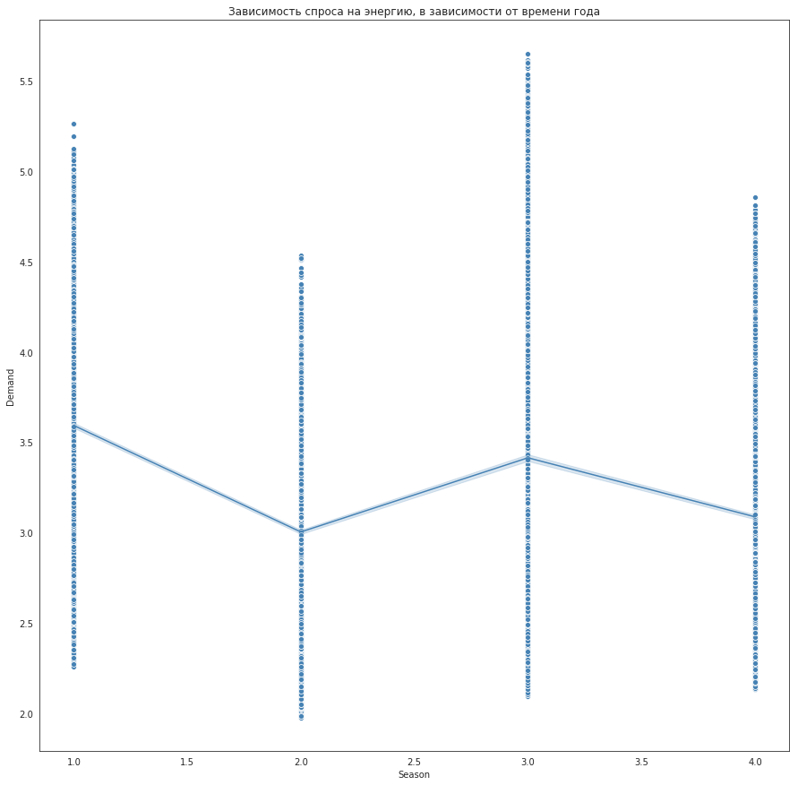

# Хакатон SocialHack 
# Кейс: Прогнозирование потребления энергии 

#### Импорт библиотек


```python
import pandas as pd
import seaborn as sns
import numpy as np
import matplotlib.pyplot as plt
import xlrd
from sklearn import preprocessing
%matplotlib inline
```

#### Подгружаем файл со статистическими данными


```python
table = pd.read_excel('data/hack_4_50.xlsx')
table = table.replace(np.nan,0)
table = table.astype(np.float64)
table.columns
```


    Index(['Time', 'Year', 'Month', 'Day_of_week', 'Season', 'Temperature',
           'Number_Of_Guest_Nights', 'Total_hours_worked', 'Sales_new_vehicles',
           'Demand'],
          dtype='object')


```python
table
```


<div>
<table border="1" class="dataframe">
  <thead>
    <tr style="text-align: right;">
      <th></th>
      <th>Time</th>
      <th>Year</th>
      <th>Month</th>
      <th>Day_of_week</th>
      <th>Season</th>
      <th>Temperature</th>
      <th>Number_Of_Guest_Nights</th>
      <th>Total_hours_worked</th>
      <th>Sales_new_vehicles</th>
      <th>Demand</th>
    </tr>
  </thead>
  <tbody>
    <tr>
      <th>0</th>
      <td>0.0</td>
      <td>1.0</td>
      <td>4.0</td>
      <td>6.0</td>
      <td>2.0</td>
      <td>14.5</td>
      <td>42178210.0</td>
      <td>1488.0</td>
      <td>324738.0</td>
      <td>2.555</td>
    </tr>
    <tr>
      <th>1</th>
      <td>1.0</td>
      <td>1.0</td>
      <td>4.0</td>
      <td>6.0</td>
      <td>2.0</td>
      <td>13.3</td>
      <td>42178210.0</td>
      <td>1488.0</td>
      <td>324738.0</td>
      <td>2.433</td>
    </tr>
    <tr>
      <th>2</th>
      <td>2.0</td>
      <td>1.0</td>
      <td>4.0</td>
      <td>6.0</td>
      <td>2.0</td>
      <td>13.8</td>
      <td>42178210.0</td>
      <td>1488.0</td>
      <td>324738.0</td>
      <td>2.393</td>
    </tr>
    <tr>
      <th>3</th>
      <td>3.0</td>
      <td>1.0</td>
      <td>4.0</td>
      <td>6.0</td>
      <td>2.0</td>
      <td>13.0</td>
      <td>42178210.0</td>
      <td>1488.0</td>
      <td>324738.0</td>
      <td>2.375</td>
    </tr>
    <tr>
      <th>4</th>
      <td>4.0</td>
      <td>1.0</td>
      <td>4.0</td>
      <td>6.0</td>
      <td>2.0</td>
      <td>12.2</td>
      <td>42178210.0</td>
      <td>1488.0</td>
      <td>324738.0</td>
      <td>2.390</td>
    </tr>
    <tr>
      <th>5</th>
      <td>5.0</td>
      <td>1.0</td>
      <td>4.0</td>
      <td>6.0</td>
      <td>2.0</td>
      <td>11.2</td>
      <td>42178210.0</td>
      <td>1488.0</td>
      <td>324738.0</td>
      <td>2.467</td>
    </tr>
    <tr>
      <th>6</th>
      <td>6.0</td>
      <td>1.0</td>
      <td>4.0</td>
      <td>6.0</td>
      <td>2.0</td>
      <td>10.8</td>
      <td>42178210.0</td>
      <td>1488.0</td>
      <td>324738.0</td>
      <td>2.631</td>
    </tr>
    <tr>
      <th>7</th>
      <td>7.0</td>
      <td>1.0</td>
      <td>4.0</td>
      <td>6.0</td>
      <td>2.0</td>
      <td>12.1</td>
      <td>42178210.0</td>
      <td>1488.0</td>
      <td>324738.0</td>
      <td>2.775</td>
    </tr>
    <tr>
      <th>8</th>
      <td>8.0</td>
      <td>1.0</td>
      <td>4.0</td>
      <td>6.0</td>
      <td>2.0</td>
      <td>13.8</td>
      <td>42178210.0</td>
      <td>1488.0</td>
      <td>324738.0</td>
      <td>2.965</td>
    </tr>
    <tr>
      <th>9</th>
      <td>9.0</td>
      <td>1.0</td>
      <td>4.0</td>
      <td>6.0</td>
      <td>2.0</td>
      <td>15.3</td>
      <td>42178210.0</td>
      <td>1488.0</td>
      <td>324738.0</td>
      <td>3.159</td>
    </tr>
    <tr>
      <th>10</th>
      <td>10.0</td>
      <td>1.0</td>
      <td>4.0</td>
      <td>6.0</td>
      <td>2.0</td>
      <td>16.7</td>
      <td>42178210.0</td>
      <td>1488.0</td>
      <td>324738.0</td>
      <td>3.211</td>
    </tr>
    <tr>
      <th>...</th>
      <td>...</td>
      <td>...</td>
      <td>...</td>
      <td>...</td>
      <td>...</td>
      <td>...</td>
      <td>...</td>
      <td>...</td>
      <td>...</td>
      <td>...</td>
    </tr>
    <tr>
      <th>26250</th>
      <td>18.0</td>
      <td>4.0</td>
      <td>3.0</td>
      <td>7.0</td>
      <td>2.0</td>
      <td>10.2</td>
      <td>39820270.0</td>
      <td>1383.0</td>
      <td>640803.0</td>
      <td>3.520</td>
    </tr>
    <tr>
      <th>26251</th>
      <td>19.0</td>
      <td>4.0</td>
      <td>3.0</td>
      <td>7.0</td>
      <td>2.0</td>
      <td>9.8</td>
      <td>39820270.0</td>
      <td>1383.0</td>
      <td>640803.0</td>
      <td>3.485</td>
    </tr>
    <tr>
      <th>26252</th>
      <td>20.0</td>
      <td>4.0</td>
      <td>3.0</td>
      <td>7.0</td>
      <td>2.0</td>
      <td>8.7</td>
      <td>39820270.0</td>
      <td>1383.0</td>
      <td>640803.0</td>
      <td>3.423</td>
    </tr>
    <tr>
      <th>26253</th>
      <td>21.0</td>
      <td>4.0</td>
      <td>3.0</td>
      <td>7.0</td>
      <td>2.0</td>
      <td>7.5</td>
      <td>39820270.0</td>
      <td>1383.0</td>
      <td>640803.0</td>
      <td>3.289</td>
    </tr>
    <tr>
      <th>26277</th>
      <td>21.0</td>
      <td>4.0</td>
      <td>3.0</td>
      <td>1.0</td>
      <td>2.0</td>
      <td>10.7</td>
      <td>39820270.0</td>
      <td>1383.0</td>
      <td>640803.0</td>
      <td>3.130</td>
    </tr>
    <tr>
      <th>26278</th>
      <td>22.0</td>
      <td>4.0</td>
      <td>3.0</td>
      <td>1.0</td>
      <td>2.0</td>
      <td>10.3</td>
      <td>39820270.0</td>
      <td>1383.0</td>
      <td>640803.0</td>
      <td>2.962</td>
    </tr>
    <tr>
      <th>26279</th>
      <td>23.0</td>
      <td>4.0</td>
      <td>3.0</td>
      <td>1.0</td>
      <td>2.0</td>
      <td>9.2</td>
      <td>39820270.0</td>
      <td>1383.0</td>
      <td>640803.0</td>
      <td>2.766</td>
    </tr>
  </tbody>
</table>
<p>26280 rows × 10 columns</p>
</div>


#### Составим корреляционную матрицу для определения зависимостей между параметрами и значением спроса на электроэнергию


```python
correlation = table.corr()
plt.figure(figsize=(20,20))
sns.heatmap(correlation, vmax=1, square=True,annot=True,cmap='cubehelix',linewidths=2)
plt.title('Correlation between different features')
```


    Text(0.5, 1.0, 'Correlation between different features')





#### На графиках зависимостей параметров от величины спроса рассмотрим распределение их значений


```python
plt.figure(figsize=(40,60))
with sns.axes_style('white'):
    g = sns.factorplot("Time","Demand", data=table, aspect=2,
                        color='steelblue')
    #g.set_xticklabels(step=40)
plt.title('Зависимость спроса на энергию, в зависимости от времени суток(часа)')
plt.show()
```





```python
plt.figure(figsize=(15,10))
with sns.axes_style('white'):
    g = sns.lineplot("Temperature","Demand", data=table,
                        color='steelblue')
    #r = sns.scatterplot("Temperature","Demand", data=table,
                        #color='steelblue')
    #g.set_xticklabels(step=40)
plt.title('Зависимость спроса на энергию, в зависимости от температуры за окном')
plt.show()
```





```python
plt.figure(figsize=(15,15))
with sns.axes_style('white'):
    g = sns.scatterplot("Season","Demand", data=table,
                        color='steelblue')
    r = sns.lineplot("Season","Demand", data=table,
                        color='steelblue')
plt.title('Зависимость спроса на энергию, в зависимости от времени года')
plt.show()
```





#### Проведем нормализацию данных


```python
COLUMNS = ['Time', 'Year', 'Month', 'Day_of_week', 'Season', 'Temperature',
       'Number_Of_Guest_Nights', 'Total_hours_worked', 'Sales_new_vehicles']
table_2 = table[COLUMNS]
```


```python
min_max_scaler = preprocessing.MinMaxScaler()
np_scaled = min_max_scaler.fit_transform(table_2)
df_normalized = pd.DataFrame(np_scaled)
df_normalized['9']=table['Demand']
```


```python
df_normalized
```


<div>
<table border="1" class="dataframe">
  <thead>
    <tr style="text-align: right;">
      <th></th>
      <th>0</th>
      <th>1</th>
      <th>2</th>
      <th>3</th>
      <th>4</th>
      <th>5</th>
      <th>6</th>
      <th>7</th>
      <th>8</th>
      <th>9</th>
    </tr>
  </thead>
  <tbody>
    <tr>
      <th>0</th>
      <td>0.000000</td>
      <td>0.0</td>
      <td>0.272727</td>
      <td>0.833333</td>
      <td>0.333333</td>
      <td>0.441463</td>
      <td>0.306226</td>
      <td>0.989305</td>
      <td>0.483919</td>
      <td>2.555</td>
    </tr>
    <tr>
      <th>1</th>
      <td>0.043478</td>
      <td>0.0</td>
      <td>0.272727</td>
      <td>0.833333</td>
      <td>0.333333</td>
      <td>0.412195</td>
      <td>0.306226</td>
      <td>0.989305</td>
      <td>0.483919</td>
      <td>2.433</td>
    </tr>
    <tr>
      <th>2</th>
      <td>0.086957</td>
      <td>0.0</td>
      <td>0.272727</td>
      <td>0.833333</td>
      <td>0.333333</td>
      <td>0.424390</td>
      <td>0.306226</td>
      <td>0.989305</td>
      <td>0.483919</td>
      <td>2.393</td>
    </tr>
    <tr>
      <th>3</th>
      <td>0.130435</td>
      <td>0.0</td>
      <td>0.272727</td>
      <td>0.833333</td>
      <td>0.333333</td>
      <td>0.404878</td>
      <td>0.306226</td>
      <td>0.989305</td>
      <td>0.483919</td>
      <td>2.375</td>
    </tr>
    <tr>
      <th>4</th>
      <td>0.173913</td>
      <td>0.0</td>
      <td>0.272727</td>
      <td>0.833333</td>
      <td>0.333333</td>
      <td>0.385366</td>
      <td>0.306226</td>
      <td>0.989305</td>
      <td>0.483919</td>
      <td>2.390</td>
    </tr>
    <tr>
      <th>5</th>
      <td>0.217391</td>
      <td>0.0</td>
      <td>0.272727</td>
      <td>0.833333</td>
      <td>0.333333</td>
      <td>0.360976</td>
      <td>0.306226</td>
      <td>0.989305</td>
      <td>0.483919</td>
      <td>2.467</td>
    </tr>
    <tr>
      <th>6</th>
      <td>0.260870</td>
      <td>0.0</td>
      <td>0.272727</td>
      <td>0.833333</td>
      <td>0.333333</td>
      <td>0.351220</td>
      <td>0.306226</td>
      <td>0.989305</td>
      <td>0.483919</td>
      <td>2.631</td>
    </tr>
    <tr>
      <th>7</th>
      <td>0.304348</td>
      <td>0.0</td>
      <td>0.272727</td>
      <td>0.833333</td>
      <td>0.333333</td>
      <td>0.382927</td>
      <td>0.306226</td>
      <td>0.989305</td>
      <td>0.483919</td>
      <td>2.775</td>
    </tr>
    <tr>
      <th>8</th>
      <td>0.347826</td>
      <td>0.0</td>
      <td>0.272727</td>
      <td>0.833333</td>
      <td>0.333333</td>
      <td>0.424390</td>
      <td>0.306226</td>
      <td>0.989305</td>
      <td>0.483919</td>
      <td>2.965</td>
    </tr>
    <tr>
      <th>9</th>
      <td>0.391304</td>
      <td>0.0</td>
      <td>0.272727</td>
      <td>0.833333</td>
      <td>0.333333</td>
      <td>0.460976</td>
      <td>0.306226</td>
      <td>0.989305</td>
      <td>0.483919</td>
      <td>3.159</td>
    </tr>
    <tr>
      <th>...</th>
      <td>...</td>
      <td>...</td>
      <td>...</td>
      <td>...</td>
      <td>...</td>
      <td>...</td>
      <td>...</td>
      <td>...</td>
      <td>...</td>
      <td>...</td>
    </tr>
    <tr>
      <th>26275</th>
      <td>0.826087</td>
      <td>1.0</td>
      <td>0.181818</td>
      <td>0.000000</td>
      <td>0.333333</td>
      <td>0.402439</td>
      <td>0.194329</td>
      <td>0.427807</td>
      <td>0.960125</td>
      <td>3.271</td>
    </tr>
    <tr>
      <th>26276</th>
      <td>0.869565</td>
      <td>1.0</td>
      <td>0.181818</td>
      <td>0.000000</td>
      <td>0.333333</td>
      <td>0.375610</td>
      <td>0.194329</td>
      <td>0.427807</td>
      <td>0.960125</td>
      <td>3.234</td>
    </tr>
    <tr>
      <th>26277</th>
      <td>0.913043</td>
      <td>1.0</td>
      <td>0.181818</td>
      <td>0.000000</td>
      <td>0.333333</td>
      <td>0.348780</td>
      <td>0.194329</td>
      <td>0.427807</td>
      <td>0.960125</td>
      <td>3.130</td>
    </tr>
    <tr>
      <th>26278</th>
      <td>0.956522</td>
      <td>1.0</td>
      <td>0.181818</td>
      <td>0.000000</td>
      <td>0.333333</td>
      <td>0.339024</td>
      <td>0.194329</td>
      <td>0.427807</td>
      <td>0.960125</td>
      <td>2.962</td>
    </tr>
    <tr>
      <th>26279</th>
      <td>1.000000</td>
      <td>1.0</td>
      <td>0.181818</td>
      <td>0.000000</td>
      <td>0.333333</td>
      <td>0.312195</td>
      <td>0.194329</td>
      <td>0.427807</td>
      <td>0.960125</td>
      <td>2.766</td>
    </tr>
  </tbody>
</table>
<p>26280 rows × 10 columns</p>
</div>


#### Разобьем выборку на тренировочную и валидационную


```python
from sklearn.model_selection import train_test_split
train , test = train_test_split(table, test_size = 0.2, random_state=42)
```


```python
train.to_csv('train_4.csv',index=False)
test.to_csv('test_4.csv',index=False)
```

# !Attention
# Обучение модели проводилось на онлайн-платформе GoogleColab
## Код ниже для воспроизведения непосредственно там

#### Подгружаем нашу выборку


```python
from google.colab import files
uploaded = files.upload()
!ls
```

#### Импортируем модули


```python
import numpy as np #модуль для численных манипуляций с большим объемом данных
import pandas as pd #модуль для работы с таблицами
from sklearn.ensemble import GradientBoostingRegressor #модуль для градиентного бустинга
from sklearn.metrics import mean_squared_error #для подсчета значения MAE - абсолютной ошибки
import seaborn as sns #для отрисовки графиков
from math import sqrt
import matplotlib.pyplot as plt
def rmse(y_true, y_pred):
    return sqrt(mean_squared_error(y_true, y_pred))
!pip install catboost
%matplotlib inline
```

 #### Переводим файлы в таблицы pandas


```python
train = pd.read_csv('train_4.csv')
test = pd.read_csv('test_4.csv')
train = train.replace(np.nan,0)
test = test.replace(np.nan, 0)
```

#### Разделяем валидационную и тренировочную выборки для проведения обучения


```python
test.columns
```


```python
COLUMNS = ['Time', 'Year', 'Month', 'Day_of_week', 'Season', 'Temperature',
       'Number_Of_Guest_Nights', 'Total_hours_worked', 'Sales_new_vehicles']
           
y_train = train['Demand'].values
X_train = train[COLUMNS].values
X_test = test[COLUMNS].values
y_test = test['Demand'].values
```

#### Запускаем обучение модели


```python
from catboost import Pool, CatBoostRegressor
train_pool = Pool(X_train, y_train)#, cat_features=[0,2,5])
test_pool = Pool(X_test)
model = CatBoostRegressor(iterations=8000, depth=8, learning_rate=0.3, loss_function='RMSE')
#train the model
model.fit(train_pool,plot = True)

```

#### Спрогнозируем спрос на электроэнергию на тестовой выборке, подсчитаем ошибку по метрике RMSE


```python
preds = model.predict(test_pool)
sqrt(mean_squared_error(y_test, preds))
```
0.20499970607702006

```python
output_data = pd.DataFrame({'Real_Demand': [],'Predict_Demand': [], 'Temperature': []})
output_data['Real_Demand'] = preds
output_data['Predict_Demand'] = y_test
output_data['Temperature'] = test['Temperature']
output_data
```


#### Построим графики зависимости спрогнозированного и реального спроса на энергию от температуры


```python
plt.figure(figsize=(65,15))
sns.set(style="whitegrid")
# RGB:

sns.lineplot(output_data['Temperature'],output_data['Real_Demand'], palette='tab10',color='green', linewidth=4).get_children()[0].set_color('w')
# RGBA:
sns.lineplot(output_data['Temperature'],output_data['Predict_Demand'], palette='tab10',color='red', linewidth=4).get_children()[1].set_color('w')
plt.title('Зависимость спроса на энергию, в зависимости от температуры, ')
plt.show()
```


```python

